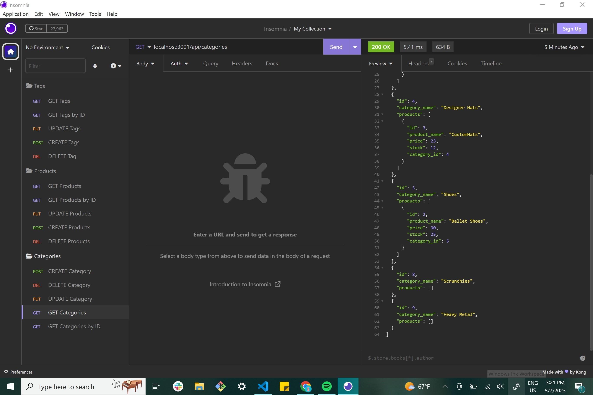

# E-commerce Back End Starter Code
# Description
GIVEN a functional Express.js API
WHEN I add my database name, MySQL username, and MySQL password to an environment variable file
THEN I am able to connect to a database using Sequelize
WHEN I enter schema and seed commands
THEN a development database is created and is seeded with test data
WHEN I enter the command to invoke the application
THEN my server is started and the Sequelize models are synced to the MySQL database
WHEN I open API GET routes in Insomnia Core for categories, products, or tags
THEN the data for each of these routes is displayed in a formatted JSON
WHEN I test API POST, PUT, and DELETE routes in Insomnia Core
THEN I am able to successfully create, update, and delete data in my database(My PUT route for my product route is having some problems it works in a bulk create function but not with the provided).
# Installation
N/A

# Credit
N/A

## Visual 

## Technologies
HTML, Javascript, Bootstrap

## Links

[GitHub Repo]
https://github.com/MariCods/Reels-N-Routes

# License
   

# Features
Able to create, update, view and delete tag, product and category id.

# Contributions
N/A